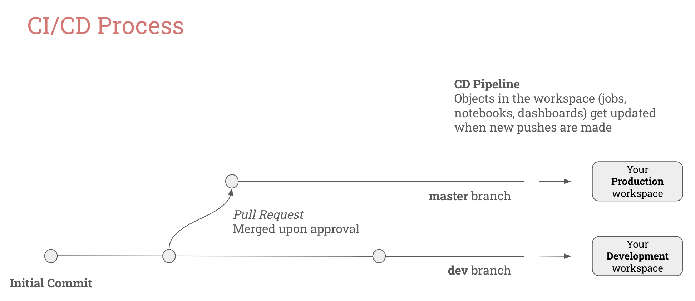

# Databricks e2e Data Project     

This is a simple end-to-end example of a Databricks MLOps project that uses the [Iris Dataset](https://scikit-learn.org/1.4/auto_examples/datasets/plot_iris_dataset.html).  
The goal of this project is to create a model that allows you to automatically classify flowers into different species based on their properties, and to have a [CI/CD](https://en.wikipedia.org/wiki/CI/CD) pipeline enabled that will allow you to easily track and deploy your code to different environments, such as Development and Production.  

As a part of this project, you will set up:
- A job for ingesting the Iris data into a feature table (which, simply speaking, is a Delta table with a Primary Key)
- A job for training a simple classification model and storing the model in the Unity Catalog
- A job that uses the model to run inferences on the top of newly collected (unidentified) flowers
- An MLflow 3.0 deployment job for automating the process of defining the model used for running the production inferences

In the "Notebooks" folder, you'll find three groups of Python notebooks:
1. **DataPreprocessing**: these are the notebooks that are used in the data preprocessing job. Within the "resources" folder, you will find a workflow called "data-preprocessing-job.yml" that basically triggers a simple data preprocessing notebook. This is just an example - we would certainly have additional notebooks for multi-stage preprocessing (e.g. source->bronze, bronze->silver, silver->gold).
2. **ModelTrainingAndDeployment**: 
  - The "model-training.ipynb" notebook is used in the "model-training-job.yml" job, which can be found in the "resources" folder. It features the code to train a simple classification model and save it to the Unity Catalog. It is important to mention that this model should be registered with the *Challenger* alias every time it gets trained. *Challenger* is a term that is used to define a model that has the potential of becoming the official model for running inferences, but not necessarily will become it, unless formally validated. 
  - The "model-evaluation.ipynb", "model-approval.ipynb" and "model-deployment.ipynb" notebooks are a part of the "model-deployment-job" workflow, which can be found in the "resources" folder. These notebooks and job were inspired by the [Deployment Jobs](https://docs.databricks.com/gcp/en/mlflow/deployment-job) concept, introduced in MLflow 3.0. The idea is to add a series of steps that include metrics evaluation and human-in-the-loop approval before effectively deploying a model for production usage (or making it the *Champion* model, for instance). As an important note: after you save the first version of your model to the UC, you need to [connect your model to the deployment job](https://docs.databricks.com/gcp/en/mlflow/deployment-job#connect-the-deployment-job-to-a-model).
  

3. **Inference**: 
  - The "batch-inference.ipynb" notebook is used in the "batch-inference-job.yml" job, which can be found in the "resources" folder. It is a simple job that uses the *Champion* model for running batch inference on the top of new Iris samples and save the results to an Inference Table. 
  - The "realtime-inference.ipynb" notebook is just there to show an example of how you can use a Serving Endpoint that is connected to your *Champion* model to run inferences in near-real-time (note: this serving endpoint gets created programatically in the "model-deployment.ipynb" notebook)

This is not the focus of this demo, but you will notice that the jobs "data-preprocessing-job.yml", "model-training-job.yml", and "batch-inference-job.yml" have a commented **job compute** setting, although I haven't specified a specific compute setting in any job. Jobs without a compute setting in their DAB templates will automatically default to serverless. Both compute approaches offer significant cost advantages: dedicated job clusters can reduce costs by up to 3x (as of the first release date of this Repository) versus interactive compute, while serverless provides scalable usage-based pricing that's entirely managed by Databricks. I definitely recommend checking out our [pricing page](https://www.databricks.com/product/pricing), as well as our [compute documentation](https://docs.databricks.com/aws/en/compute/) for more accurate and updated info on pricing!  

Now, talking about the other elements from this repository in more depth:
  - The file **databricks.yml** is a file that defines how to deploy all of these jobs in an automatic fashion using [Databricks Asset Bundles](https://docs.databricks.com/aws/en/dev-tools/bundles/). The jobs will be parameterized based on whether they are *development* or *production* jobs. By running a simple ```databricks bundle deploy --target <dev, prod>``` command, all of those jobs should be automatically created within your workspace (provided you have the necessary permissions to create these resources), pointing to the right resources depending on each environment. Note that you can set different permissions to the objects depending on the environment that you're in! 
  - The file **.github/workflows/databricks-deployment.yml** specifies the *Continuous Deployment (CD)* piece of our work if you use GitHub as your CI/CD tool. You can set up commands to run whenever changes occur to your codebase by leveraging [GitHub Actions](https://github.com/features/actions). For instance, if a push occurs to the dev branch of this repository, the command `databricks bundle deploy --target dev` will run automatically; and if a push is made to the main branch, the `databricks bundle deploy --target prod` command will get executed. 
  - The file **azure-pipelines.yml** specifies the *Continuous Deployment (CD)* piece of our work if you use Azure DevOps as your CI/CD tool. You can set up commands to run whenever changes occur to your codebase by leveraging [Pipelines](https://azure.microsoft.com/en-us/products/devops/pipelines). For instance, if a push occurs to the *dev* branch of this repository, the command `databricks bundle deploy --target dev` will run automatically; and if a pull request is made to the *master* branch, the `databricks bundle deploy --target prod` command will get executed. 

Having a *Continuous Deployment (CD)* pipeline enabled means that if you make any changes to your dev branch, your dev pipelines will be updated; and if you make any changes to your master branch, your prod pipelines will be automatically updated. 

  

**Wrap up:** as a part of this demo, you have created notebooks and jobs for a fictional MLOps end-to-end pipeline. By connecting your dev and prod workspaces and preparing your CI/CD setup, you will be able to deploy automatic updates to your Dev and Prod environments with a click of a button! Below, you can check the list of jobs that will get created in the demo, which can be easily filtered by using the tag **Project**: "e2e-data-project".  

  
  
  
**Notes**: 
 - If you want to clone this Repo to reproduce it on your end, don't forget to change the **host** and **catalog_name** from the [databricks.yml](databricks.yml) file, and: 
     - If you are using GitHub Actions, you need to add 2 Secrets called **DATABRICKS_CLIENT_ID** and **DATABRICKS_CLIENT_SECRET** with your service principal authentication details and also update the **DATABRICKS_HOST** variable in the [.github/workflows/databricks-deployment.yml](.github/workflows/databricks-deployment.yml) file; 
     - If you use Azure DevOps, then you also have to add these 2 parameters as pipeline secrets (**DATABRICKS_CLIENT_ID** and **DATABRICKS_CLIENT_SECRET**), and update the **DATABRICKS_HOST** variable in the [azure-pipelines.yml](azure-pipelines.yml) file. 
 - For this simple tutorial, we are using the same workspace and service principal for Dev and Prod, for the simplicity of demonstrating it. Make sure to check our documentation for more details on authentication and on how to manage different environments! 

**Learn more**: 
 - Check out the [Big Book of MLOps](https://www.databricks.com/resources/ebook/the-big-book-of-mlops).
 - Here you can find more info on how to manage different environments for MLOps: [MLOps Workflows](https://docs.databricks.com/aws/en/machine-learning/mlops/mlops-workflow).
 - If you don't want to retrain your models in each environment, you can **promote** your models across environments. Check out this documentation for more info: [Promote a model across environments](https://docs.databricks.com/aws/en/machine-learning/manage-model-lifecycle#promote-a-model-across-environments).  
 - This is a more advanced template for MLOps, called the "MLOps Stacks" template: [MLOps Stacks: model development process as code](https://docs.databricks.com/aws/en/machine-learning/mlops/mlops-stacks). It may be worth checking it as you mature and grow in your MLOps journey!

**Q&A**:
- **Can I specify who I want the approvers to be in my deployment job?** Yes, you restrict who has permissions to **APPLY TAGs** and also set a [governed tag policy](https://docs.databricks.com/aws/en/admin/governed-tags/) so only certain people are allowed to set a specific tag value (in this case, it will be the "approval" tag).
- **Can I get notified when there's a model to approve?** Yes, you can set up your deployment jobs to send an email notification upon job failures to the approvers. 

Let us know if you need support in your MLOps journey! 